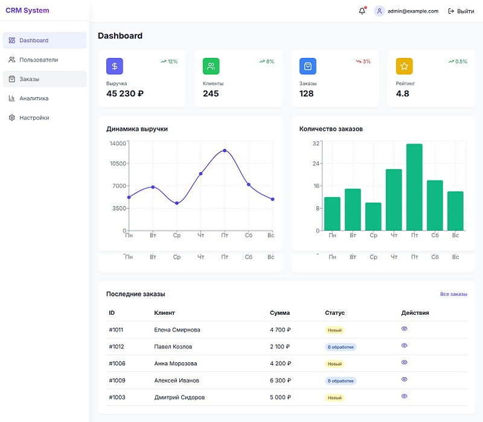
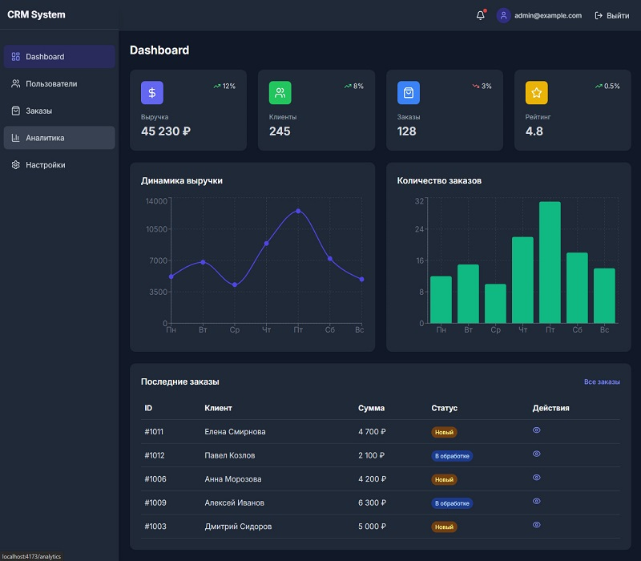

# CRM Dashboard


## 🚀 О проекте

Панель управления бизнесом с темной/светлой темой. React + TypeScript + Redux Toolkit.

## 🚀 Функционал

| Функция | Описание |
|---------|----------|
| 📊 Дашборд | Графики выручки и заказов |
| 👥 Пользователи | CRUD операции, фильтрация |
| 📦 Заказы | Просмотр, фильтрация, экспорт в CSV |
| 📈 Аналитика | Прогнозирование продаж |
| 🌙 Тема | Светлая/темная тема |
| 📱 Адаптив | Работает на всех устройствах |

## 🛠 Технологии

- React 18 + TypeScript
- Redux Toolkit
- Tailwind CSS
- Recharts
- Framer Motion
- React Router


🔑 Тестовый доступ
Поле	  Значение
Email	  admin@example.com
Пароль	123456

## 🚀 Демо

<a href="https://semeeensemeeenov23.github.io/crm-dashboard/" target="_blank">Посмотреть демо</a>


## 📸 Скриншоты

### Светлая тема


### Темная тема


📞 Контакты
GitHub: @semeeensemeeenov23


## 🏃‍♂️ Запуск проекта

```bash
git clone https://github.com/semeeensemeeenov23/crm-dashboard.git
cd crm-dashboard
npm install
npm run dev
